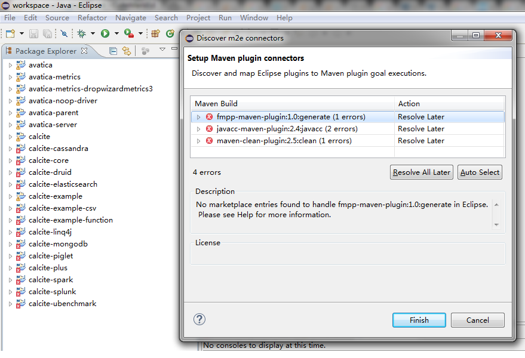
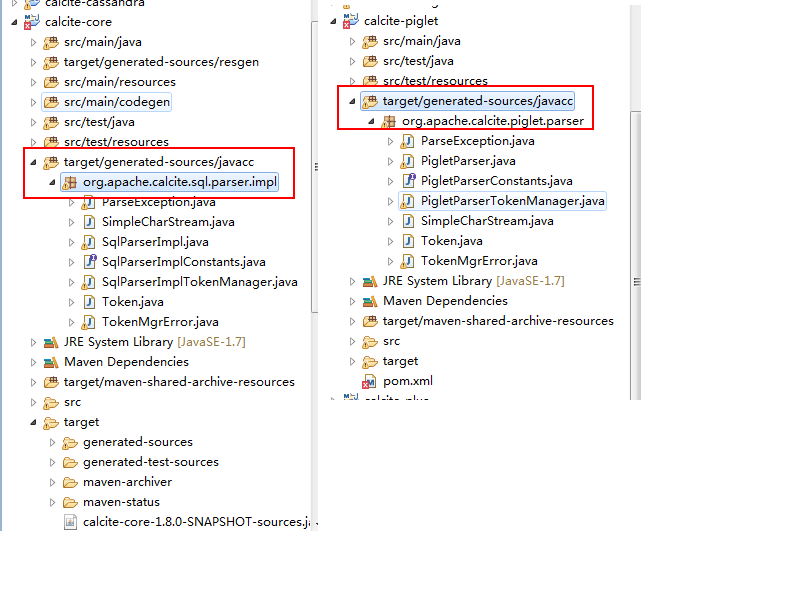
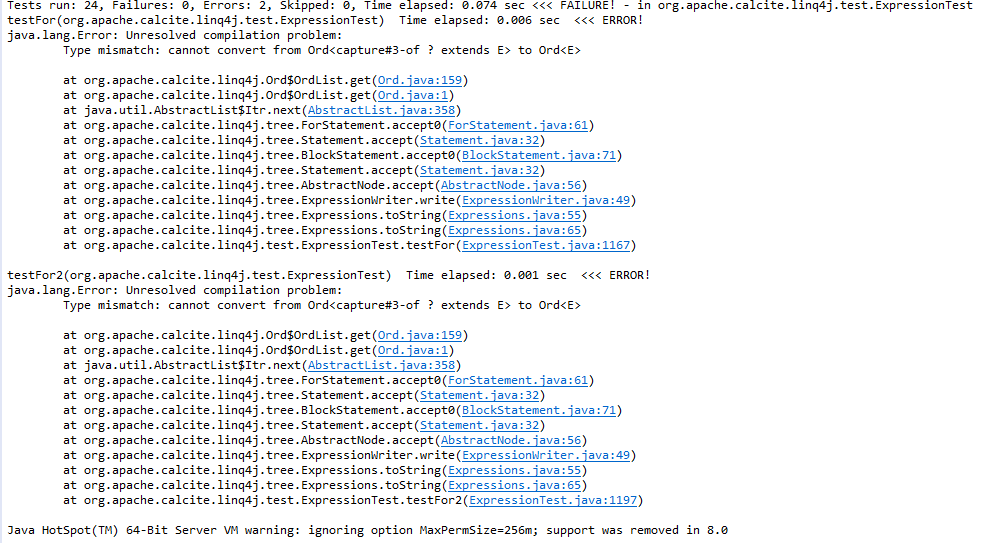
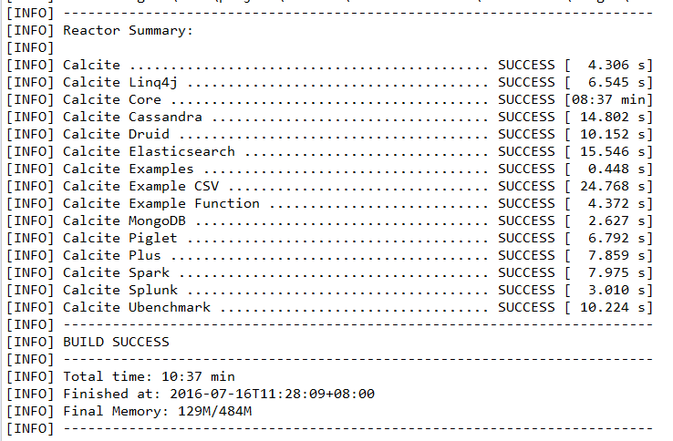

# 前言

Calctie是一款优秀的动态数据管理框架。可以以统一的SQL查询语言接口进行数据的管理。
官网的文档上说Calcite本身并不进行数据存储以及数据处理，其原理大约也是对sql进行语法解析，生成执行计划或者关系操作树，最后将这些操作交由各个数据源进行执行。

一直想在这类框架上做一些有趣的实现。于是开启了对其文档翻译以及源码分析的工作，旨在了解平台运作的原理，能力边界以及使用的场景。

本教程是一个动态进行时，内容随时会跟着研究更新。 为了避免一些猜测性的想法和已经探明的事实混淆一起，将会在已经确认的章节上进行标记 checked ，已经确认章节可以放心阅读。    


# 源码下载安装与环境搭建

源码下载安装:标准的mvn 文件，通常， 只要人品不是太差，就基本能够建立好安装运行环境。   


## 构建前准备:

1. 准备好一壶茶，真的，依赖包的下载太耗时间了。    
2. 下载Maven 并安装   
Calcite使用Maven进行构建，请自行安装mvn，本系列用到的Maven版本是 3.3.9。最好手工指定仓库到一个目录下，以后方便打包带走的，以后安装也不需要重新下载。   
假如，你不想耗那么多时间在下载上的话，请解压 files/mvn_plugins_package下的 repository.7z 放到你本地的maven repo 下。
3. 下载Eclipse 发行版 NEON x64    
4. 下载项目包    
目前使用版本: 1.8.0 时下最新的了。    
下载地址: https://github.com/apache/calcite/archive/calcite-avatica-1.8.0.zip   
但很不幸的是，在源码过程中分析需要用到子项目：avatica。
而1.8.0 的版本实际上用到的是 1.7.1 的avatica。这个坑不小，试了半天才知道的。
所以还需要下载一个:https://github.com/apache/calcite/archive/calcite-avatica-1.7.1.tar.gz   
5. 可选的安装 eclipse freemaker 插件(尚未确定是否会有用)    
http://stackoverflow.com/questions/9385561/freemarker-eclipse-plug-in   
6. 可选的安装 eclipse javacc 插件(尚未确定是否会有用)   
http://eclipse-javacc.sourceforge.net/   
7. 可选的安装 用以本系列画消息图的 mscgen:   
http://www.mcternan.me.uk/mscgen/software/mscgen_0.20.exe   
8. 可选的安装 用以本系列画图的 graphviz:   
http://www.graphviz.org/Download.php
9. 调试项目目录 PROJECT_DIR=d:\calcite_analysis   


## 构建:   
1. 整合项目
 - 解压calcite-avatica-1.8.0.zip中calcite-avatica-1.8.0文件夹下的所有文件到PROJECT_DIR；
 - 删除PROJECT_DIR下avatica目录；
 - 解压calcite-avatica-1.7.1.tar.gz，将calcite-avatica-1.7.1文件夹下avatica目录拷贝至PROJECT_DIR
并将修改avatica目录下pom.xml文件，检查avatica的版本，并在< modules>元素下加入
 ```
  <module>avatica</module>
 ```  
或者可以用本教程目录下\resource\files\calcite\pom.xml文件直接替换PROJECT_DIR\calcite\pom.xml；
2. 找开命令行，切换路径至PROJECT_DIR下，执行mvn clean install；    
3. 喝茶；
4. 打开eclipse，file -> import -> existing maven projects.选中PROJECT_DIR目录。全部项目都导入eclispe。
 > maven build过程中会报插件错误，可忽略，直接Finish即可
 > 

5. 执行完第4步后，项目还会缺少org.apache.calcite.sql.parser.impl和org.apache.calcite.piglet.parser依赖：
 - 打开calcite-core项目下/target/generated-sources/，点击javacc,右键-->build path --> use as source folder；
 - 打开calcite-piglet项目下/target/generated-sources/，点击javacc,右键-->build path --> use as source folder；
 > 此处一定要在javacc上右键build path，否则包路径会不对。
 > 
6. 在elicpse中在calcite主项目上再用maven**命令**去cleant和install一遍(即在maven build的goals里输入命令clean install执行)。
  > 如果不是用命令install，仍有报错：
   虽然打开calcite-piglet项目下org/apache/calcite/linq4j/Ord.java把第74行和159行的报错都强转成Ord<E>重新编译就能通过。但为了能在不改动源码的情况下做分析，建议在命令行里去编译。
7. 打完收工。

> 关于在构建中遇到的问题的排查:
1. maven build 插件错误   可忽略

## 本教程目录说明
1. README.MD 主要的文档
2. imgs 图片目录   
imgs/capture  抓图   
imgs/handrawing  手绘图片   
imgs/dot graphviz生成   
imgs/mscgen  mscgen生成的时序图    
3. resource 资源目录    
resource\files  用到的文件    
resource\dot    graphviz的生成脚本    
resource\mscgen   mscgen的生成脚本    

#贡献者
alan2lin    
demo   
(广告位招租)